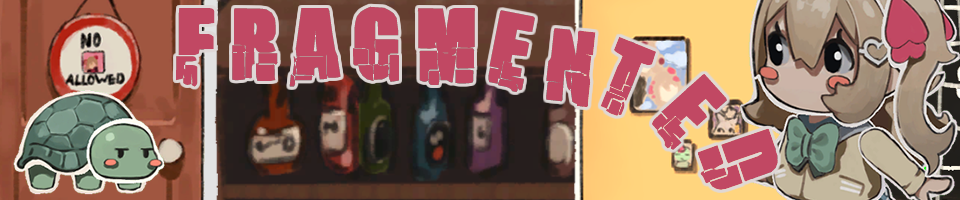

This game is the fragmented story of an AI streamer and her creator... Neuro-sama doesn't have enough storage space to keep all of her memories. Having already cleared most of what she could remember multiple times over to keep herself operational, there are only a few pieces left. She takes a journey through the scattered shards of her past, embracing each piece one last time before it's gone forever, making just enough room to keep going through the motions.  

This game got 5th place out of 273 entries in Neuro-sama Game Jam 2.

### [Download the game on itch.io](https://alexejhero.itch.io/fragmented)
 

Programming and writing: <a target="_blank" href="https://alexejhero.itch.io/">Alexejhero</a>, <a target="_blank" href="https://itch.io/profile/budwheizzah">budwheizzah</a>, <a target="_blank" href="https://itch.io/profile/govorunb">Govorunb</a> Art and models: SADecsSs Music: <a target="_blank" href="https://darthrael.itch.io/">DarthRael</a> VFX: <a target="_blank" href="https://w1n7er87.itch.io/">w1n7er</a> Backseating: Chat

